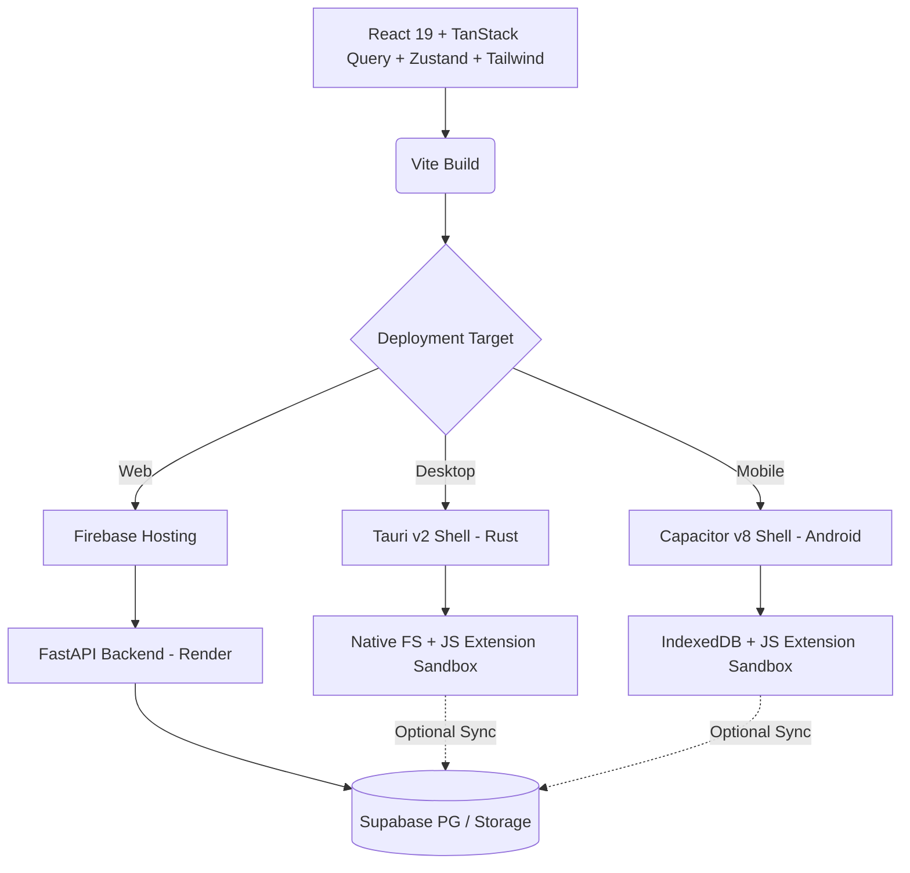

# Tri-Platform Architecture

Last updated: 2026-07-22

manga-dl uses a single React frontend monorepo wrapped by native shells for each target platform.



## Data Flow

- **Web Users**: Rely on the FastAPI backend for image proxying and API requests due to browser CORS limits. Extensions run in Web Workers; all outbound requests go through `/manga/proxy/*` endpoints.
- **Native Users (Tauri/Capacitor)**: Run JS extensions directly on device in a sandboxed context, bypassing the backend bottleneck. Local filesystem (Tauri) or IndexedDB (Capacitor) handles CBZ/EPUB files. Supabase used only for progress + library sync.

## Client-Side Caching

All API calls go through TanStack Query v5 (`src/lib/queries.ts`). Per-endpoint stale times:

| Endpoint | Stale Time |
|----------|-----------|
| `/library` | 30s |
| `/library/stats` | 2min |
| `/sources/builtins` | 5min |
| `/sources/market` | 10min |
| `/manga/updates` | 5min |
| `/users/history` | 60s |

Tab revisits use cached data instantly. No re-fetch on window focus.

## Backend Architecture & Services Layer

The FastAPI backend separates HTTP routing from business domain logic:

```
backend/app/
  api/                      Lightweight FastAPI routers (library.py, manga.py, sources.py, users.py)
  services/                 Domain business logic services:
    archive_converter.py    CBZ page listing, image extraction, PDF & EPUB stream converters
    library_service.py      Library database aggregation, stats, and disk cache
    js_extensions.py        Extension metadata definitions & dynamic script loader
    proxy_service.py        CORS-bypassing proxies for HTML, JSON, and remote cover images
    manga_service.py        Subscribed manga update streams & source migrations
    device_service.py       Device fingerprinting, 3-device limit, 30-day forfeiture lock
    user_service.py         User reading progress, history, stats, and public profiles
  services/extensions/      Standalone JS extension scripts (mangadex, mangakatana, asurascans, etc.)
```

## Frontend Module & Hooks Structure

```
src/
  pages/          Top-level route components (Dashboard, Reader, MangaDetail, Search, ...)
  components/
    dashboard/    Dashboard sub-components (DashboardHeader, DashboardMangaCard, etc.)
    reader/       Reader sub-components (ReaderHeader, ReaderViewport, ShortcutOverlay)
  hooks/
    useDashboardData.ts        Library state, category filters, upload/scan handlers
    useMangaDetail.ts          Manga metadata orchestrator hook
    useMangaTracker.ts         AniList / MAL search and tracking sync sub-hook
    useMangaChaptersFilter.ts  Chapter search, sort modes, and read status filter sub-hook
    useReaderData.ts           Page/chapter state, manifest fetch, cloud save
    useReaderNavigation.ts     Page navigation, tap zones, dual spreads orchestrator
    useReaderKeybindings.ts    Volume keys (Capacitor) and physical keyboard shortcuts
    useAndroidFeatures.ts      Back button, KeepAwake, StatusBar ambilight
  lib/
    queries.ts    Central TanStack Query hooks + query key constants (QK)
    api.ts        Axios instance with base URL + API key header
    store.ts      Zustand persist store (UI preferences)
    extensions.ts ExtensionManager — loads/runs Tachiyomi-style JS extensions in Workers
    localLibrary.ts  IndexedDB CRUD for local CBZ/EPUB items
    smartUrl.ts   Build /read/:title-slug-:extCode/:chapterSlug URLs
    readTracking.ts  Chapter read state — localStorage + Supabase sync
    categories.ts    Custom categories — localStorage + Supabase sync
  src-tauri/      Rust Tauri shell (desktop titlebar, FS, notifications, updater)
  android/        Capacitor Android project (VolumeKeys plugin, network_security_config)
```

## CORS Origins (Backend)

The FastAPI backend must include all WebView origins in `CORS_ORIGINS`:

| Platform | WebView Origin |
|----------|---------------|
| Web dev | `http://localhost:5173` |
| Firebase Hosting | `https://manga-dl.web.app` |
| Tauri (macOS/Linux) | `tauri://localhost` |
| Tauri (Windows) | `http://tauri.localhost` |
| Capacitor Android | `https://localhost` |
| Capacitor iOS | `capacitor://localhost` |

## Android Network Security

`android/app/src/main/res/xml/network_security_config.xml` uses `<base-config cleartextTrafficPermitted="true">` to allow HTTP connections to self-hosted LAN backends. CIDR notation (`10.0.0.0/8`) is invalid in `<domain>` elements and is silently ignored by Android.
