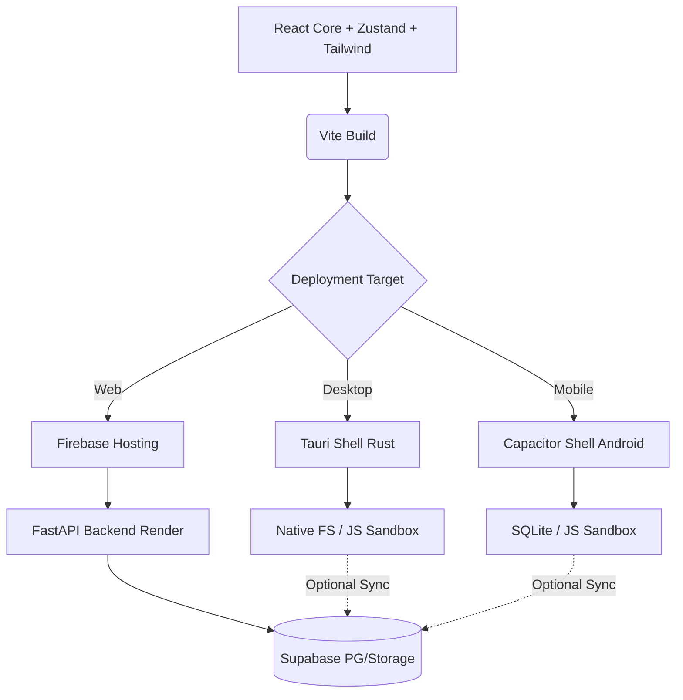

# Tri-Platform Architecture

Manga OS utilizes a single frontend monorepo wrapped by native shells.

## Data Flow
- **Web Users**: Rely on the FastAPI backend for scraping due to browser CORS limits.
- **Native Users (Tauri/Capacitor)**: Run JS scrapers directly on device, bypassing backend bottleneck. Local storage handles gigabytes of CBZ files instantly. Supabase used only for progress syncing.
