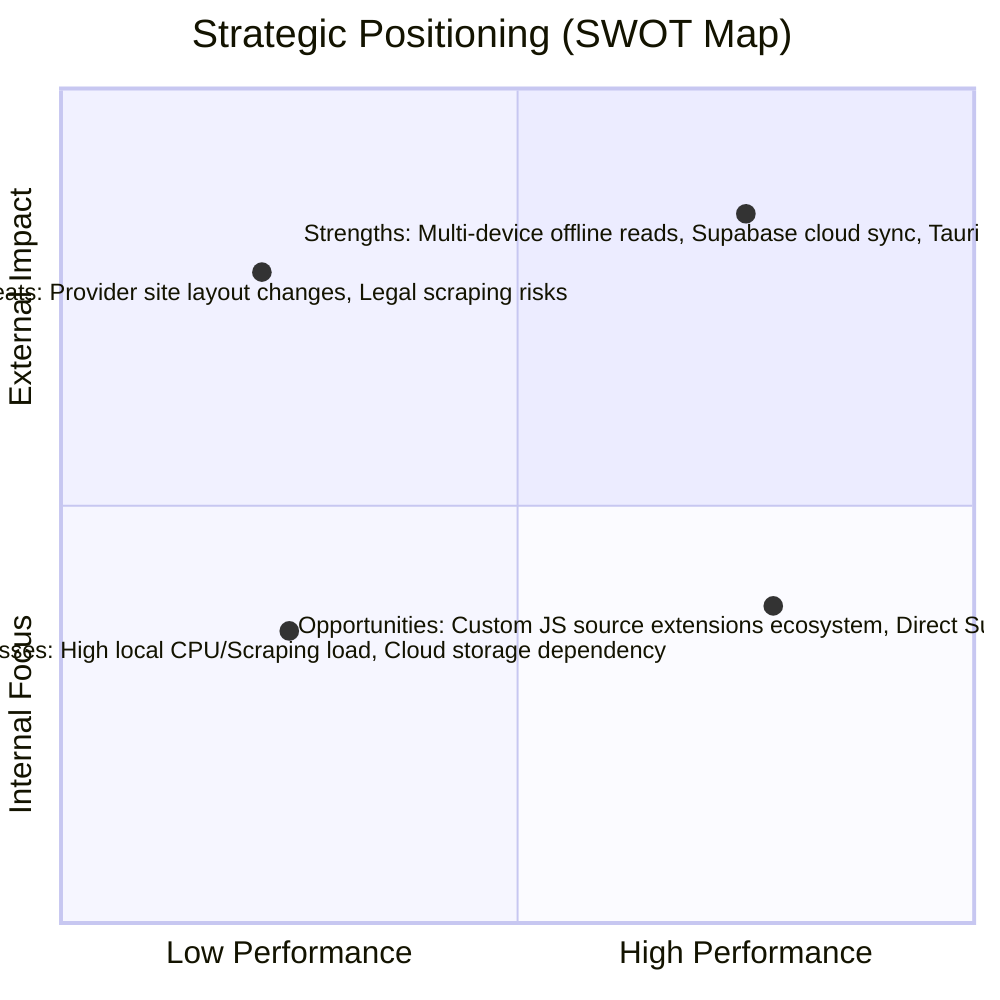

# Manga OS (manga-dl) Comprehensive System Analysis

This document provides a multi-dimensional strategic, functional, and user-experience evaluation of the **Manga OS (manga-dl)** ecosystem across Web, Desktop (Tauri), and Mobile (Capacitor) platforms.

---

## 1. SWOT Analysis



### Strengths (Internal, Positive)
* **Unified Cross-Platform Core:** Shared React codebase deployed to Web, Android (Capacitor), and Desktop (Tauri).
* **Robust Offline Capability:** Local CBZ/ZIP/EPUB parser allows zero-network reading via IndexedDB or Capacitor/Tauri file systems.
* **Granular Cloud Synchronization:** Progress, history, and category updates are synced continuously to Supabase.
* **Performance Optimization:** Native platforms run JS scraping logic directly on the client, bypassing backend server IP bans and cloudflare challenges.

### Weaknesses (Internal, Negative)
* **Complex Local Environment Requirements:** Desktop version requires Python 3.10+ in the environment PATH to run the local backend server, creating setup friction for non-technical users.
* **Scraper Fragility:** Reliance on raw DOM selectors makes scrapers highly sensitive to layout updates on provider sites (e.g., Asura, MangaDex).
* **Storage Consumption Constraints:** Offline archives consume significant device storage, demanding aggressive eviction and sync optimization.

### Opportunities (External, Positive)
* **Source Extension Standardization:** Integrating a sandboxed plugin runner (similar to Keiyoushi or Tachiyomi) to allow users to build and import custom sources.
* **Supabase CDN Deliverability:** Direct downloads of pre-packaged release assets from Supabase Storage instead of redirections to GitHub.
* **Progressive Web App (PWA) Penetration:** Seamless offline installation on iOS platforms where App Store rules restrict native sideloading.

### Threats (External, Negative)
* **Legal and Copyright Compliance:** Aggressive scraping of copyrighted material risks domain takedowns or legal actions.
* **Anti-Bot Protections:** Cloudflare and DDoS-Guard mitigation scripts on source websites can break client-side scrapers.
* **Platform Security Policies:** Hardening of sandboxing features in iOS/Android can restrict local filesystem directory scanning.

---

## 2. Gap Analysis

Evaluating the difference between the **Current State** (prior implementations) and the **Target State** (completed architecture).

| Dimension | Current State | Target State | Action Required to Close Gap |
| :--- | :--- | :--- | :--- |
| **Platform Shell Routing** | Mobile/Desktop shells land on the public landing page `/`, requiring manual navigation. | Native apps detect their wrapper (Tauri/Capacitor) and bypass the landing page directly to `/r` (library). | Add runtime shell detection using window properties (`__TAURI_INTERNALS__` and `Capacitor`) and execute a routing shortcut. |
| **Typography & Styling** | Standard system sans-serif font or anime-style typography. | Premium, high-contrast typography matching Druk/Anton headers and Inter metadata text. | Import and wire Anton/Inter font families in `index.css` and restructure CSS styling rules in `Landing.tsx`. |
| **Tablet Width Breakpoints** | Columns squish and tag elements overlap on viewport widths between 843px and 1213px. | Responsive grid wrapping and flex-wrap boundaries prevent overlaps. | Refactor flex containers to allow wrapping, set min-widths, and adjust padding inside `Sources.tsx`. |
| **Access Control & Security** | All users can trigger downloads, populate custom categories, and write to backend `/library`. | Write-actions, categories, and downloads are restricted exclusively to `zenmisan@gmail.com`. | 1. Implement backend JWT verification on library/download endpoints.<br>2. Hide download/upload controls on frontend for non-admin accounts. |
| **Asset Distribution Channel** | Native installations redirect to GitHub Releases, causing friction. | Direct asset delivery hosted natively on Supabase Storage bucket. | Update `Landing.tsx` and `DownloadHub.tsx` links to reference the Supabase storage bucket directly. |

---

## 3. User & UX Analysis

### Key Personas

```
+----------------------------------------------------+
|               THE MULTI-DEVICE READ                |
|  Reads on Desktop at night, Android on the train.  |
|  Demands instant cloud progress synchronization.  |
+----------------------------------------------------+
                          |
                          v
+----------------------------------------------------+
|               THE OFFLINE COLLECTOR                |
|  Downloads entire series to read without internet. |
|  Requires high-fidelity CBZ/EPUB compatibility.   |
+----------------------------------------------------+
```

### UX Bottlenecks & Resolutions

1. **Native App Cold Start Landing Page:**
   * *Problem:* Showing a marketing landing page on mobile/desktop apps is redundant and confusing.
   * *Solution:* Direct detection of Tauri/Capacitor runtime flags routes the shell straight to the library dashboard, optimizing time-to-content.
2. **Sources Page Overlap on Viewport Scaling:**
   * *Problem:* Mid-size viewports (tablet widths) squished tags together, causing visual overlap.
   * *Solution:* Refactored flex layouts into flexible wrapping cards, ensuring legible grid flows.
3. **Download Flow Friction:**
   * *Problem:* Non-technical readers got confused when download links redirected them to GitHub releases.
   * *Solution:* Moved assets to public Supabase CDN storage, offering instant downloads in one click.

---

## 4. Feature Analysis

Evaluating core features based on **Implementation Complexity** and **User Value**.

```
Value
  ^
  |  [High Value / Low Complexity]           [High Value / High Complexity]
  |  - Direct Supabase Releases              - Supabase Cloud Sync
  |  - Landing Page Redirect Bypass          - Multi-Source Image Descrambling
  |  - Typography Update (Anton/Inter)
  |
  |  [Low Value / Low Complexity]            [Low Value / High Complexity]
  |  - Local scan folder (Tauri only)        - Batch local PDF conversion
  |
  +-----------------------------------------------------------------------> Complexity
```

---

## 5. Heuristic Evaluation

Based on Jakob Nielsen's 10 Usability Heuristics:

1. **Visibility of System Status:**
   * *Evaluation:* Excellent feedback via live syncing badges and animated download bars. The backend-unreachable warning guides users on installation errors.
2. **User Control and Freedom:**
   * *Evaluation:* Incognito toggle allows users to halt history logs. Pinned chapters give control over cache eviction systems.
3. **Consistency and Standards:**
   * *Evaluation:* Standardized use of `lucide-react` icons and unified styling tokens.
4. **Error Prevention:**
   * *Evaluation:* Non-admin accounts are restricted from write actions. This prevents data sync conflicts on shared instances.
5. **Aesthetic and Minimalist Design:**
   * *Evaluation:* The Anton + Inter typeface upgrade delivers a high-premium dark layout. Minimal borders and glassmorphism elements elevate focus on the artwork covers.

---

## 6. Cost-Benefit Analysis

Evaluating cloud-backed client applications vs. self-contained native code.

```
Cloud + Multi-Platform Strategy:
  - Pros: High synchronization, PWA availability, premium delivery.
  - Cons: Supabase storage costs, complex CORS rules.
  
Self-Contained Local Strategy:
  - Pros: 0$ hosting overhead, absolute privacy.
  - Cons: Manual export backups, no multi-device sync.
```

### Strategic Recommendation
Combine the two! By keeping databases local (SQLite/IndexedDB) and using Supabase as a lightweight sync and delivery layer, Manga OS keeps cloud costs extremely low while maintaining multi-device synchronization.

---

## 7. Risk Analysis & Mitigation

| Threat Event | Likelihood | Impact | Mitigation Strategy |
| :--- | :--- | :--- | :--- |
| **API Abuse / High Storage Costs** | High | Critical | Restrict library write APIs and download queues strictly to `zenmisan@gmail.com`. Non-authorized clients are limited to client-side online reads. |
| **Cloudflare Ban on Scrapers** | High | High | Run scraper scripts directly on the client (Tauri/Capacitor) so they inherit the reader's residential IP instead of the backend's cloud IP. |
| **Database Synchronization Race Conditions** | Medium | Medium | Implement timestamps on category modifications. Use upsert triggers on Supabase with conflicts resolved in favor of the latest `updated_at` parameter. |

---

## 8. SCAMPER Framework

* **S (Substitute):** Substitute GitHub Release hosting with Supabase CDN storage to offer direct, seamless downloads.
* **C (Combine):** Combine the desktop/mobile wrappers with auto-detection routes, landing users directly on the reading catalog.
* **A (Adapt):** Adapt Asura/Astro Island scraping code to handle image descrambling locally using custom canvas pixel decoding blocks.
* **M (Modify):** Modify the default typography to **Anton + Inter** to give the platform a modern, graphic design feel.
* **P (Put to another use):** Repurpose IndexedDB as a local cache layer to allow reading online chapters offline without a full download task.
* **E (Eliminate):** Eliminate downloads and library modifications for non-admin accounts to protect backend database resources.
* **R (Reverse):** Reverse the platform checking order—route from landing screen to library *automatically* on apps, keeping the landing screen strictly for web traffic.
